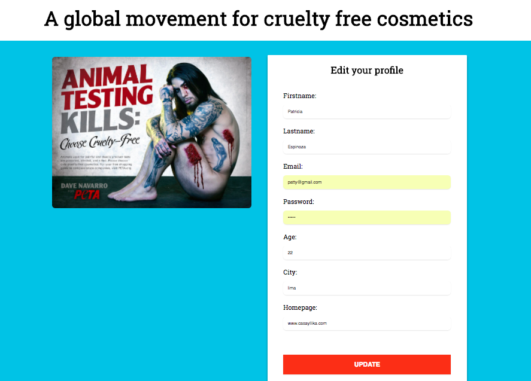

# Petition:

This project is a petition to stop animal cruelty in the cosmetic industry.

The idea behind this project is to create an online petition that visitors can sign to make their voice heard on an issue of your choosing.

## Features:

1. Login and registration.

2. A canvas element where the users can drawn their signatures and saved them.

3. We are using PostgresSQL as a database.

### Images:

